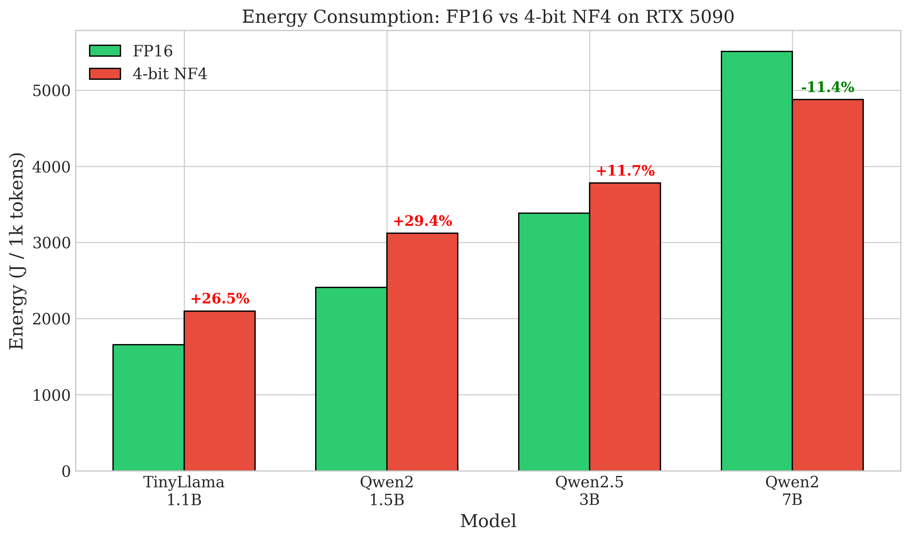

# EcoCompute-AI: Energy Efficiency of Quantized LLM Inference

[](https://opensource.org/licenses/MIT)
[](https://www.python.org/downloads/)
[](https://arxiv.org/abs/2025.XXXXX)

This repository contains the experimental data, analysis scripts, and benchmark code for the paper:

> **Energy Efficiency of Quantized Large Language Model Inference: A Comprehensive Review and Empirical Analysis**
> 
> Hongping Zhang
> 
> *Submitted to [Journal Name], 2025*

## 🔬 Key Findings

We document a previously unreported **Quantization Efficiency Paradox**:

- **4-bit quantization increases energy consumption by 11.7%–29.4%** for sub-5B parameter models on high-throughput GPUs (RTX 5090)
- Energy savings only manifest for larger models (≥7B parameters)
- The crossover point varies by GPU architecture based on compute-to-bandwidth ratio



## 📊 Repository Structure

```
ecocompute-ai/
├── data/                           # Experimental data
│   ├── rtx5090_benchmark_results.csv   # RTX 5090 benchmark results
│   ├── t4_benchmark_results.csv        # T4 benchmark results
│   └── telemetry_config.json           # Hardware telemetry configuration
├── scripts/                        # Analysis and benchmark scripts
│   ├── energy_benchmark.py             # Main benchmarking script
│   ├── analyze_results.py              # Results analysis and visualization
│   ├── roofline_analysis.py            # Theoretical framework implementation
│   └── run_full_benchmark.py           # Full benchmark suite runner
├── figures/                        # Generated figures for paper
│   ├── fig1_energy_comparison.pdf
│   ├── fig2_energy_trend.pdf
│   └── fig3_power_throughput.pdf
├── paper/                          # LaTeX source files
│   └── review_paper_energy_efficiency.tex
├── requirements.txt                # Python dependencies
└── README.md                       # This file
```

## 🚀 Quick Start

### Installation

```bash
# Clone the repository
git clone https://github.com/hongping-zh/ecocompute-ai.git
cd ecocompute-ai

# Create virtual environment
python -m venv venv
source venv/bin/activate  # On Windows: venv\Scripts\activate

# Install dependencies
pip install -r requirements.txt
```

### Running Benchmarks

```bash
# Single model benchmark
python scripts/energy_benchmark.py \
    --model "Qwen/Qwen2-1.5B-Instruct" \
    --config nf4 \
    --iterations 10 \
    --output results.csv

# Full benchmark suite
python scripts/run_full_benchmark.py --output data/benchmark_results.csv
```

### Analyzing Results

```bash
# Generate figures and statistical analysis
python scripts/analyze_results.py \
    --data data/rtx5090_benchmark_results.csv \
    --output figures/
```

### Roofline Analysis

```bash
# Theoretical framework analysis
python scripts/roofline_analysis.py \
    --gpu rtx5090 \
    --model qwen2-1.5b \
    --case-study
```

## 📈 Experimental Results

### Main Results (RTX 5090)

| Model | Config | Throughput (tok/s) | Power (W) | Energy (J/1k tok) | Δ Energy |
|-------|--------|-------------------|-----------|-------------------|----------|
| TinyLlama-1.1B | FP16 | 94.87 ± 0.42 | 157.45 ± 2.13 | 1659.00 ± 18.2 | --- |
| TinyLlama-1.1B | NF4 | 55.79 ± 0.81 | 117.02 ± 1.54 | 2098.44 ± 31.5 | **+26.5%*** |
| Qwen2-1.5B | FP16 | 71.45 ± 0.38 | 172.30 ± 2.87 | 2411.09 ± 25.6 | --- |
| Qwen2-1.5B | NF4 | 41.57 ± 0.63 | 129.83 ± 1.92 | 3120.49 ± 42.1 | **+29.4%*** |
| Qwen2.5-3B | FP16 | 54.77 ± 0.35 | 185.59 ± 3.21 | 3382.64 ± 38.4 | --- |
| Qwen2.5-3B | NF4 | 31.85 ± 0.52 | 120.46 ± 1.78 | 3779.60 ± 48.7 | **+11.7%*** |
| Qwen2-7B | FP16 | 70.47 ± 0.51 | 388.34 ± 5.42 | 5508.56 ± 62.3 | --- |
| Qwen2-7B | NF4 | 41.40 ± 0.68 | 201.88 ± 3.15 | 4877.88 ± 55.8 | **-11.4%*** |

*Statistical significance: ***p < 0.001 (paired t-test)*

### Telemetry Configuration

| Parameter | RTX 5090 | T4 |
|-----------|----------|-----|
| NVML Sampling | 10 Hz | 10 Hz |
| CUDA Version | 12.7 | 12.2 |
| bitsandbytes | 0.45.0 | 0.45.0 |
| Idle Power | 45.2 W | 12.8 W |

## 🧮 Theoretical Framework

We adapt the Roofline model to predict quantization energy efficiency:

```
E_Q4/E_FP16 = (P_Q4/P_FP16) × (T_FP16/T_Q4)
```

Where:
- `E` = Energy consumption
- `P` = Power draw
- `T` = Throughput (tokens/second)

The crossover point depends on the GPU's compute-to-bandwidth ratio:

| GPU | Compute (TFLOPS) | Bandwidth (TB/s) | Ratio (FLOP/Byte) | Crossover |
|-----|------------------|------------------|-------------------|-----------|
| RTX 5090 | 660 | 1.8 | 367 | ~5B |
| RTX 4090 | 330 | 1.0 | 327 | ~4B |
| T4 | 65 | 0.3 | 217 | ~2B |

## 📝 Citation

If you use this code or data in your research, please cite:

```bibtex
@article{zhang2025energy,
  title={Energy Efficiency of Quantized Large Language Model Inference: 
         A Comprehensive Review and Empirical Analysis},
  author={Zhang, Hongping},
  journal={arXiv preprint arXiv:2025.XXXXX},
  year={2025}
}
```

## 🤝 Contributing

Contributions are welcome! Please feel free to submit a Pull Request. For major changes, please open an issue first to discuss what you would like to change.

## 📄 License

This project is licensed under the MIT License - see the [LICENSE](LICENSE) file for details.

## 🙏 Acknowledgments

- NVIDIA for NVML power monitoring tools
- Hugging Face for the Transformers library
- bitsandbytes team for quantization implementations

## 📧 Contact

- **Author**: Hongping Zhang
- **Email**: [your-email@example.com]
- **GitHub**: [@hongping-zh](https://github.com/hongping-zh)

---

*This research contributes to the Green AI initiative by providing empirical evidence and practical guidelines for energy-efficient LLM deployment.*
