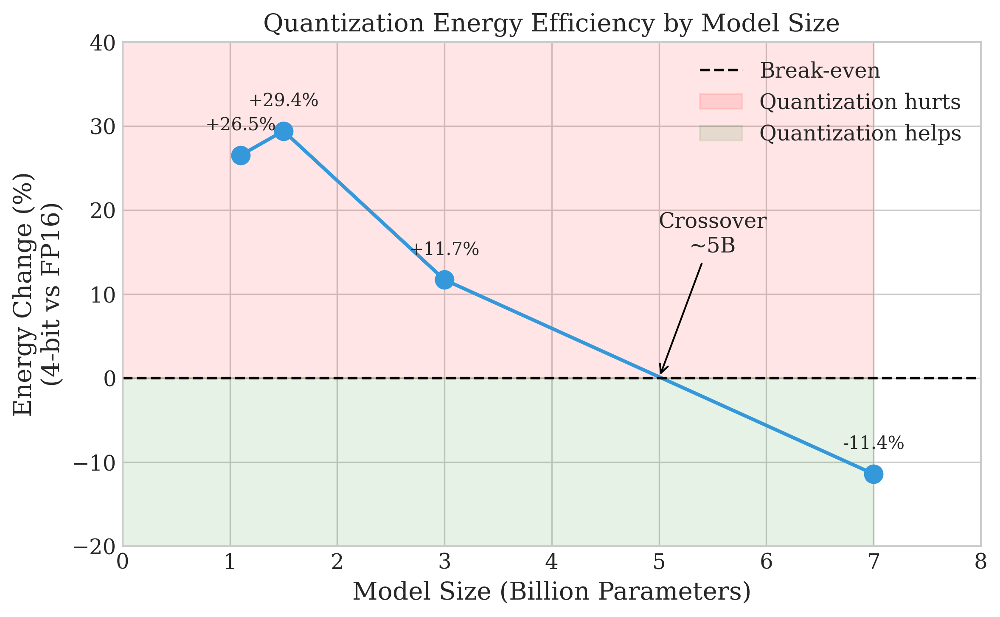
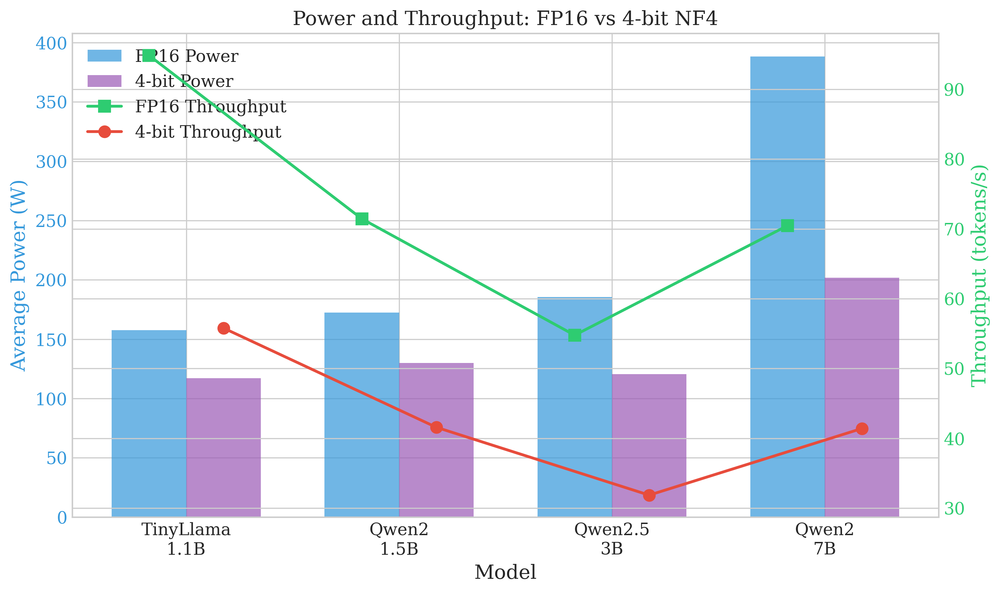

# When Quantization Hurts: The Surprising Energy Cost of 4-bit LLMs on RTX 5090

**TL;DR**: We benchmarked 4-bit quantization vs FP16 on the new RTX 5090 and found that **quantization increases energy consumption by up to 29% for models smaller than 5B parameters**. Only 7B+ models benefit from quantization in terms of energy efficiency.

---

## The Assumption We All Made

4-bit quantization is everywhere. Tools like bitsandbytes, GPTQ, and AWQ have made it trivially easy to shrink LLMs to a quarter of their original size. The benefits seem obvious:

- ✅ 4x less memory
- ✅ Fits larger models on consumer GPUs
- ✅ Lower power consumption
- ✅ **Better for the environment... right?**

We assumed that last point was true. **We were wrong.**

---

## The Experiment

We got our hands on an **NVIDIA RTX 5090** (the new Blackwell architecture, 32GB GDDR7, 575W TDP) and ran a comprehensive energy benchmark comparing:

- **FP16**: Native half-precision inference
- **4-bit NF4**: bitsandbytes quantization

We tested 4 models spanning 1.1B to 7B parameters:

| Model | Parameters |
|-------|------------|
| TinyLlama | 1.1B |
| Qwen2 | 1.5B |
| Qwen2.5 | 3B |
| Qwen2 | 7B |

For each configuration, we generated 256 tokens × 10 samples while measuring power consumption at 100ms intervals using NVML.

---

## The Results

| Model | FP16 Energy | 4-bit Energy | Change |
|-------|-------------|--------------|--------|
| TinyLlama 1.1B | 1,659 J/1k tokens | 2,098 J/1k tokens | **+26.5%** 🔴 |
| Qwen2 1.5B | 2,411 J/1k tokens | 3,120 J/1k tokens | **+29.4%** 🔴 |
| Qwen2.5 3B | 3,383 J/1k tokens | 3,780 J/1k tokens | **+11.7%** 🔴 |
| Qwen2 7B | 5,509 J/1k tokens | 4,878 J/1k tokens | **-11.4%** 🟢 |

**Wait, what?**

For models under 5B parameters, 4-bit quantization uses **MORE energy**, not less!

---

## The Crossover Point

There's a clear pattern:

- **1.1B**: +26.5% more energy with 4-bit
- **1.5B**: +29.4% more energy with 4-bit
- **3B**: +11.7% more energy with 4-bit (gap narrowing)
- **7B**: -11.4% less energy with 4-bit ✅

The **crossover point** where quantization becomes beneficial is around **5B parameters** on RTX 5090.

---

## Why Does This Happen?

The answer lies in the **de-quantization overhead**.

When you use 4-bit quantization, the GPU must:
1. Load 4-bit weights from memory
2. **De-quantize** them to FP16 for computation
3. Perform the actual matrix multiplication

For **small models**:
- Memory bandwidth isn't the bottleneck (model fits easily in cache)
- De-quantization overhead becomes a significant fraction of total compute
- **Result**: More energy consumed

For **large models**:
- Memory bandwidth IS the bottleneck
- 4-bit reduces memory traffic by ~4x
- De-quantization cost is amortized over more compute
- **Result**: Energy savings

The key insight: **4-bit quantization always reduces power draw** (by 24-48%), but it also **reduces throughput by ~40%**. For small models, the throughput penalty outweighs the power savings.

---

## Practical Guidelines

Based on our findings, here's what we recommend for RTX 5090:

| Scenario | Recommendation |
|----------|----------------|
| Models < 5B | **Use FP16** (quantization hurts) |
| Models ≥ 5B | **Use 4-bit** (saves ~11% energy) |
| VRAM-constrained | Use 4-bit (accept energy penalty) |
| Latency-critical | Use FP16 (40% faster) |

---

## Implications for Green AI

This finding has important implications for sustainable AI:

1. **Don't assume quantization = green**. For small models, you're actually increasing your carbon footprint.

2. **Right-size your model**. A 3B FP16 model may be more environmentally friendly than a 7B quantized model for your use case.

3. **Measure, don't assume**. Energy efficiency varies by hardware and model size.

4. **Hardware matters**. The crossover point likely differs on other GPUs (T4, A100, etc.). We hypothesize it would be smaller on memory-bandwidth-limited hardware.

---

## Methodology Notes

- **GPU**: NVIDIA GeForce RTX 5090 (Blackwell, sm_120)
- **Power measurement**: NVML via pynvml, 100ms sampling
- **Quantization**: bitsandbytes NF4 with FP16 compute dtype
- **Test protocol**: 10 samples × 256 tokens, with warmup and cooldown

Full technical report and code available on [GitHub](https://github.com/your-repo).

---

## What's Next?

We're planning to:
1. Test other quantization methods (GPTQ, AWQ) to see if they have lower de-quantization overhead
2. Benchmark on other GPUs (A100, L4, T4) to map the crossover point across hardware
3. Explore power-limiting as a way to shift the crossover point

---

## Conclusion

**4-bit quantization is not a silver bullet for Green AI.** On high-performance GPUs like the RTX 5090, it only provides energy savings for models larger than ~5B parameters. For smaller models, stick with FP16—it's faster AND more energy-efficient.

The next time someone tells you quantization is always better for the environment, show them this data. 📊

---

*This research was conducted as part of the EcoCompute AI project. We welcome feedback and collaboration!*

**Tags**: #GreenAI #LLM #Quantization #EnergyEfficiency #RTX5090 #Sustainability

---

## About the Author

[Your name and bio here]

---

*If you found this useful, please share it with the community! Let's make AI more sustainable together.* 🌱
