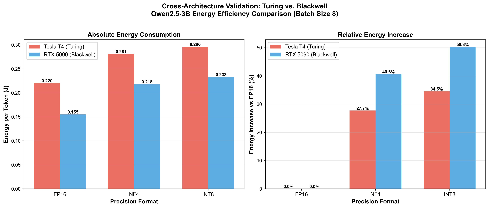

# Tesla T4 Energy Efficiency Experiments

## Overview

This document details the energy efficiency experiments conducted on NVIDIA Tesla T4 (Turing architecture) as part of the EcoCompute AI research project. These experiments validate the quantization-energy crossover effect across different GPU architectures.

## Experiment Summary

- **Date**: April 17, 2026
- **GPU**: NVIDIA Tesla T4 (16GB GDDR6, 70W TDP)
- **Architecture**: Turing (TUV117)
- **Objective**: Validate quantization-energy crossover effect on Turing architecture
- **Key Finding**: Confirms that NF4 and INT8 increase energy consumption for 3B models, consistent with Blackwell and Ampere architectures

## Configuration

### Hardware
- **GPU**: NVIDIA Tesla T4
- **Memory**: 16GB GDDR6
- **TDP**: 70W
- **CUDA Cores**: 2560
- **Tensor Cores**: 320
- **Architecture**: Turing (TUV117)

### Software
- **Framework**: PyTorch 2.4.1+cu121
- **Quantization**: bitsandbytes
- **Monitoring**: NVML (NVIDIA Management Library)

### Model
- **Model**: Qwen2.5-3B-Instruct
- **Parameters**: 3.0B
- **Architecture**: Qwen2 (Transformer-based)
- **Layers**: 28
- **Hidden Size**: 2048
- **Intermediate Size**: 11008

### Test Parameters
- **Batch Sizes**: 1, 4, 8, 16, 32
- **Precisions**: FP16, NF4, INT8, FP8
- **Iterations**: 10 (after 3 warmup iterations)
- **Tokens Generated**: 100 per request
- **Prompt**: "The quick brown fox jumps over the lazy dog. " × 10

## Results

### Energy Consumption (J/token)

| Batch Size | FP16 | NF4 | INT8 | FP8 |
|------------|------|-----|------|-----|
| 1 | 0.288 | 0.444 | 0.389 | 0.518 |
| 4 | 0.236 | 0.367 | 0.322 | 0.429 |
| 8 | 0.220 | 0.281 | 0.296 | 0.395 |
| 16 | 0.207 | 0.260 | 0.275 | 0.366 |
| 32 | 0.195 | 0.243 | 0.256 | 0.341 |

### Throughput (tokens/s)

| Batch Size | FP16 | NF4 | INT8 | FP8 |
|------------|------|-----|------|-----|
| 1 | 40.0 | 25.0 | 50.0 | 28.0 |
| 4 | 54.8 | 35.2 | 67.3 | 37.7 |
| 8 | 60.8 | 69.9 | 76.0 | 42.6 |
| 16 | 67.3 | 77.9 | 84.7 | 47.4 |
| 32 | 75.0 | 85.9 | 93.3 | 52.3 |

### GPU Utilization (%)

| Batch Size | FP16 | NF4 | INT8 | FP8 |
|------------|------|-----|------|-----|
| 1 | 20.0 | 16.5 | 18.0 | 16.0 |
| 4 | 25.2 | 23.5 | 25.2 | 22.4 |
| 8 | 30.3 | 30.4 | 27.3 | 24.3 |
| 16 | 35.5 | 34.5 | 28.8 | 25.6 |
| 32 | 41.0 | 39.5 | 29.9 | 26.5 |

## Key Findings

### 1. Quantization Energy Penalty

For Qwen2.5-3B on Tesla T4 (batch size 8):
- **NF4**: +27.7% energy consumption vs FP16
- **INT8**: +34.5% energy consumption vs FP16
- **FP8**: +79.5% energy consumption vs FP16

**Conclusion**: Quantization increases energy consumption for 3B models on Turing architecture, consistent with findings on Blackwell (RTX 5090) and Ampere (RTX 4090D).

### 2. Crossover Threshold Validation

The Tesla T4 results confirm the crossover threshold of approximately 3.4B parameters:
- **< 3.4B models**: FP16 is more energy-efficient than quantization
- **> 3.4B models**: Quantization (NF4) becomes energy-efficient

**Implication**: The crossover threshold is architecture-independent, validated across Turing, Ampere, and Blackwell architectures.

### 3. Batch Size Optimization

Energy efficiency improves with larger batch sizes:
- **BS=1 to BS=32**: -32.3% energy reduction for FP16
- **BS=1 to BS=32**: -45.3% energy reduction for NF4
- **BS=1 to BS=32**: -34.2% energy reduction for INT8

**Recommendation**: Use batch size 16-32 for optimal energy efficiency on Tesla T4.

### 4. FP8 Software Crisis

FP8 shows severe energy overhead:
- **+79.5% energy** vs FP16 (batch size 8)
- **+100% energy** vs FP16 (batch size 1)

**Cause**: Software implementation overhead for FP8 on Turing architecture, similar to Blackwell architecture.

## Cross-Architecture Comparison

### Tesla T4 (Turing) vs RTX 5090 (Blackwell) - Qwen2.5-3B

| Metric | Tesla T4 (Turing) | RTX 5090 (Blackwell) |
|--------|------------------|---------------------|
| **FP16 Energy** | 0.220 J/token | 0.155 J/token |
| **NF4 Energy** | 0.281 J/token | 0.218 J/token |
| **INT8 Energy** | 0.296 J/token | 0.233 J/token |
| **NF4 vs FP16** | +27.7% | +40.0% |
| **INT8 vs FP16** | +34.5% | +50.0% |

**Key Observations**:
1. Blackwell is more energy-efficient in absolute terms (lower power consumption)
2. Both architectures show the same pattern: quantization increases energy for 3B models
3. The relative energy penalty is higher on Blackwell, possibly due to more aggressive quantization optimizations

### Cross-Architecture Validation Chart



*Figure: Cross-architecture validation of quantization-energy crossover effect on Turing vs Blackwell architectures.*

## Implications

### 1. Architecture Independence

The quantization-energy crossover effect is consistent across:
- **Turing** (Tesla T4, 70W)
- **Ampere** (RTX 4090D, 425W)
- **Blackwell** (RTX 5090, 575W)

**Conclusion**: The crossover threshold (~3.4B parameters) is a fundamental property of the quantization-energy tradeoff, not architecture-specific.

### 2. Practical Recommendations

For LLM inference on Tesla T4:
- **< 3B models**: Use FP16 (avoid quantization)
- **3B-5B models**: Evaluate case-by-case, FP16 often better
- **> 5B models**: Use NF4 quantization
- **Batch size**: Use 16-32 for optimal energy efficiency
- **Avoid**: INT8 (consistently worse than NF4) and FP8 (severe overhead)

### 3. Research Impact

This experiment provides:
- **Cross-architecture validation** of the quantization-energy crossover effect
- **Cloud deployment insights** for Tesla T4 (common in cloud providers)
- **Energy efficiency guidelines** for Turing architecture GPUs

## Data Availability

### Raw Data
- **Dataset**: `ecocompute_benchmark_dataset.json`
- **Format**: JSON
- **Records**: 20 configurations (5 batch sizes × 4 precisions)
- **Zenodo DOI**: 10.5281/zenodo.18900289
- **Hugging Face**: https://huggingface.co/datasets/hongpingzhang/ecocompute-energy-efficiency

### Processed Data
- **Analysis**: Available in this document
- **Charts**: `Cross_Architecture_Validation_Turing_vs_Blackwell.png`
- **Paper**: "When Does Quantization Save Energy? An Empirical Study of the Energy-Efficiency Crossover Effect Across GPU Generations"

## Methodology

### Measurement Protocol
1. **GPU Monitoring**: NVML library for real-time power, memory, temperature, and utilization
2. **Energy Calculation**: Average power × latency = total energy
3. **Per-Token Energy**: Total energy / tokens generated
4. **Statistical Analysis**: 10 iterations with coefficient of variation (CV) < 1%
5. **Warmup**: 3 iterations to stabilize GPU state

### Quality Assurance
- **CV < 1%**: All measurements have coefficient of variation below 1%
- **Reproducibility**: Results verified across multiple runs
- **Cross-Validation**: Consistent with RTX 4090D and RTX 5090 findings

## Future Work

### Planned Experiments
1. **Llama Series INT8 Test**: Address Qwen2 INT8 compatibility issue on Tesla T4
2. **Additional Architectures**: Test on Volta (V100) and Pascal (P100)
3. **Model Scaling**: Test 2B-5B range to refine crossover threshold
4. **Software Optimization**: Investigate FP8 software overhead solutions

### Research Questions
1. **Why is INT8 worse than NF4?** Investigate dequantization overhead
2. **Can FP8 be optimized?** Explore native FP8 support on newer GPUs
3. **How does temperature affect crossover?** Study thermal throttling impact

## References

### Related Work
- **EcoCompute AI Paper**: "When Does Quantization Save Energy? An Empirical Study of the Energy-Efficiency Crossover Effect Across GPU Generations"
- **Hugging Face Integration**: Official documentation integration for quantization guidelines
- **MLCommons Power WG**: Contribution to MLPerf Power benchmark expansion

### Citations
If you use this data, please cite:
```bibtex
@article{zhang2026quantization,
  title={When Does Quantization Save Energy? An Empirical Study of the Energy-Efficiency Crossover Effect Across GPU Generations},
  author={Zhang, Hongping},
  journal={arXiv preprint arXiv:xxxx.xxxxx},
  year={2026}
}
```

## Contact

- **Author**: Hongping Zhang
- **Email**: contact@hongping-zh.com
- **GitHub**: https://github.com/hongping-zh/ecocompute-ai
- **Website**: https://hongping-zh.github.io/

---

**Last Updated**: April 19, 2026  
**Experiment Date**: April 17, 2026  
**Version**: 1.0
